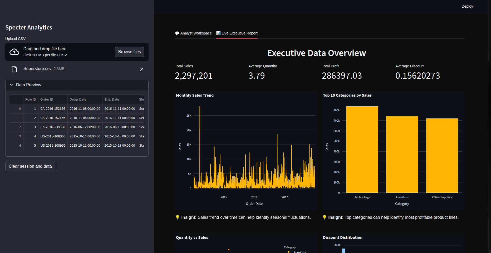
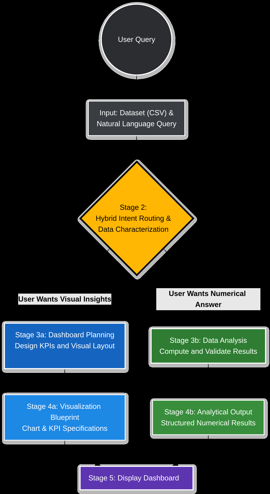
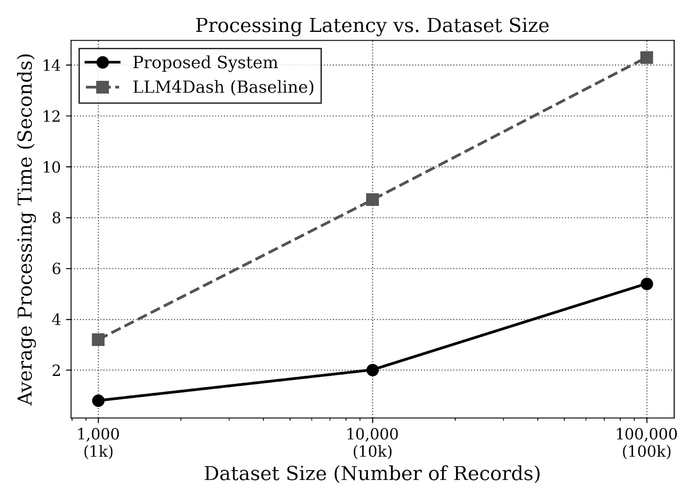
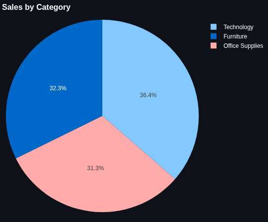
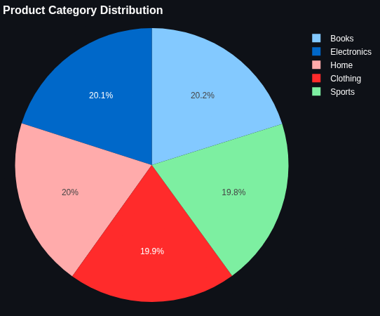

<div align="center">

```
███████╗██████╗ ███████╗ ██████╗████████╗███████╗██████╗ 
██╔════╝██╔══██╗██╔════╝██╔════╝╚══██╔══╝██╔════╝██╔══██╗
███████╗██████╔╝█████╗  ██║        ██║   █████╗  ██████╔╝
╚════██║██╔═══╝ ██╔══╝  ██║        ██║   ██╔══╝  ██╔══██╗
███████║██║     ███████╗╚██████╗   ██║   ███████╗██║  ██║
╚══════╝╚═╝     ╚══════╝ ╚═════╝   ╚═╝   ╚══════╝╚═╝  ╚═╝
         A N A L Y T I C S
```

# Specter Analytics

**Automated Exploratory Data Analysis · Safe · Deterministic · Production-Ready**

[](mailto:2023010030913@gndu.ac.in)
[](#results)
[](#results)
[](#safety)
[](https://llama.meta.com/)

*Divyansh Gawri · Dept. of Computational Statistics & Data Analytics*  
*Guru Nanak Dev University, Amritsar, Punjab, India*

</div>

---

## What It Does

Specter Analytics lets you **talk to your data in plain English and get real dashboards back** — instantly. Upload a CSV, ask a question, and the system figures out the right chart, computes the right numbers, and renders the result. No code. No manual configuration.

- 📊 **Visualizations** — bar charts, pie charts, line trends, scatter plots, KPI cards
- 🔢 **Numerical analysis** — aggregations, averages, grouped summaries, correlations
- 🧩 **Multi-chart dashboards** — full layout-aware dashboards from a single conversational prompt
- 💡 **Auto-generated insights** — narrative explanations written alongside every chart

---

## The Dashboard

> Ask a question in plain English. Get a fully built, insight-annotated dashboard.



*The system automatically selects KPIs, chart types, and layout — then annotates each chart with a generated insight. No configuration needed.*

---

## System Architecture

The framework runs as a four-stage pipeline — each stage has a clear contract, and no stage can corrupt another's output.



| Stage | What it does |
|---|---|
| **Schema Inference** | Converts your dataset into a validated metadata profile. The LLM never sees raw data — eliminating hallucinated columns and type errors. |
| **Intent Routing** | Classifies your query using fast keyword matching before falling back to LLM classification. Keeps latency low. |
| **Architect–Analyst Decoupling** | Plans the full dashboard structure first, validates it structurally, *then* generates code. |
| **Runtime Guardrails** | Executes code in a sandboxed namespace. Forbidden tokens (`os`, `sys`, `exec`, `eval`, `open`) trigger immediate rejection. |

---

## Results

Evaluated on **130 natural language queries** across analytical, visualization, and adversarial categories.

### Execution Outcomes

| Query Type | Success Rate |
|---|---|
| Analytical (averages, totals, grouped summaries) | **94%** |
| Visualization (charts, trends, comparisons) | **82%** |
| Adversarial (restricted imports, system commands) | **100% refused** |
| **Overall ESR** | **92% (118 / 130)** |

### Latency vs. Competitors



| System | Avg. Latency | Accuracy |
|---|---|---|
| **Specter Analytics** | **2.06s** | **92%** |
| LLM4Dash | 8.7s | 85% (drops to 76% on complex queries) |
| LIDA | 12.3s | Qualitative only |

Specter is **4.2× faster than LLM4Dash** and **6× faster than LIDA**, while scaling linearly with dataset size.

### User Study

21 participants (9 data analysts, 9 software engineers, 3 novices) rated Specter against expert-authored dashboards:

| Metric | Score |
|---|---|
| Clarity | **4.7 / 5** (SD = 0.3) |
| Correctness | **4.3 / 5** (SD = 0.4) |
| Insight accuracy vs. human | **94% match** |

---

## Auto-Generated Visualizations

Specter selects the optimal chart type autonomously — no user configuration. Below: a human-authored baseline (left) vs. Specter's autonomous output (right) on the same dataset and query.

<div align="center">

| Human-authored baseline | Specter autonomous output |
|:---:|:---:|
|  |  |
| *Manually configured* | *Generated from a conversational prompt* |

</div>

Chart type, layout, aggregations, and color mapping were all determined entirely by the system — faithfully replicating the baseline's analytical intent.

---

## Safety

All synthesized code is inspected before execution. Any match against the forbidden token set causes immediate rejection — zero execution occurs.

```
Forbidden:  os · sys · exec · eval · compile · open · subprocess · socket
Allowed:    pandas · numpy · whitelisted builtins · immutable dataset copy
```

No partial malicious executions across all 30 adversarial test prompts.

---

## Tech Stack

| Component | Technology |
|---|---|
| LLM backbone | Llama-3.3-70B (zero-temperature decoding) |
| Frontend / Dashboard | Streamlit |
| Data processing | pandas, numpy |
| Execution sandbox | Restricted Python namespace |

---

## License & IP Notice

> **⚠ Proprietary — Pre-Publication**  
> Copyright © 2026 Divyansh Gawri. All Rights Reserved.

- **No unauthorized use** — execution or deployment is prohibited until research publication is finalized
- **No derivative works** — the multi-agent pipeline and DAG architecture may not be reproduced or modified
- **No benchmarking** — comparative testing requires express written consent

For collaboration or access inquiries → **2023010030913@gndu.ac.in**

---

## Acknowledgements

Developed under the guidance of **Prof. Harkiran Kaur**, Guru Nanak Dev University, whose expertise and feedback were invaluable throughout this research.

---

<div align="center">

*Guru Nanak Dev University · Amritsar, Punjab, India · 2026*

</div>
